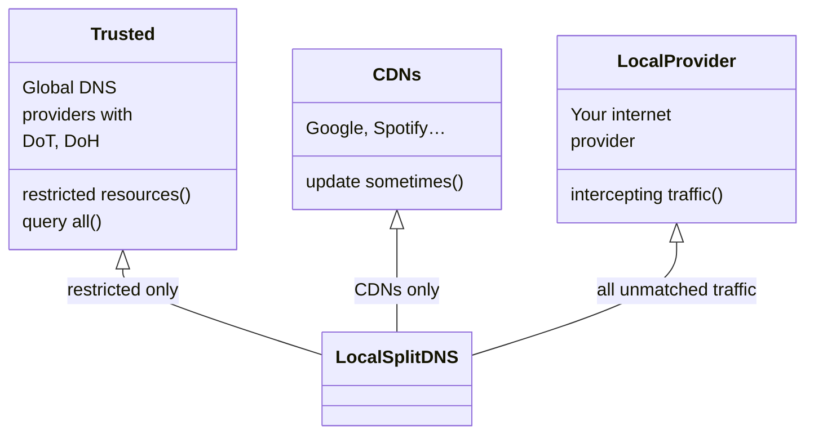

# DNS
DNS as Code

## Restrictions

Today you don't have access to the whole internet. Country regulations, site geo protections, different sites for different regions hugely affects internet browsing. It will no better in the furture.

In Russia providers should block resources, marked as restricted by government agency RosKomNadzor (short RKN). Most of the internet using HTTPS now, so they ban IP addresses. And sometimes that IP addresses the same for unrestricted resources. One of the goals of this project is to get access to unrestricted resources, wrongfully blocked by RKN.

Take a look at the diagram:

Diagram code

Usually local internet providers provide their own DNS servers. By using those servers you allow to eavesdrop on your unencrypted DNS packets and alter them. 
  

## Speed
  
DNS resolve should be fast, otherwise whole browsing experience will be bad.

`dnsmasq` DHCP and DNS server can query all the configured forwarders. And give result as soon as first responds.

## (Extra) Local hosts resolve for homelab

https://coredns.io/ is highly configurable
https://github.com/coredns/coredns/issues/3917

nodejs
https://github.com/song940/node-dns
https://habr.com/ru/post/440050/
https://github.com/trevoro/node-named
